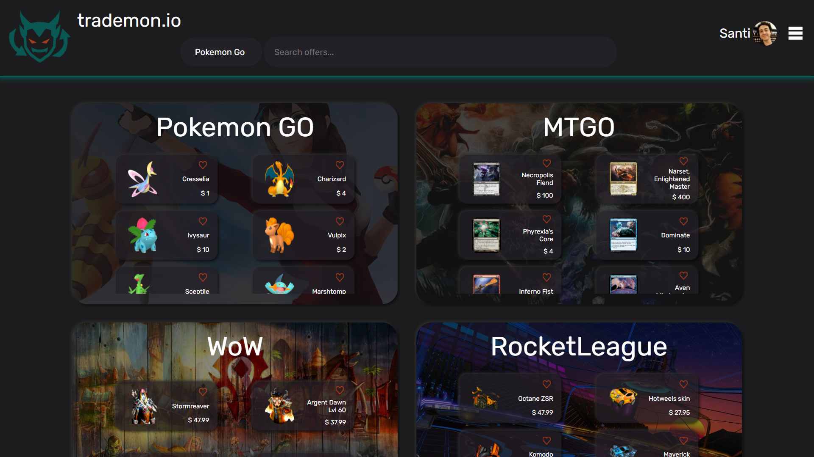
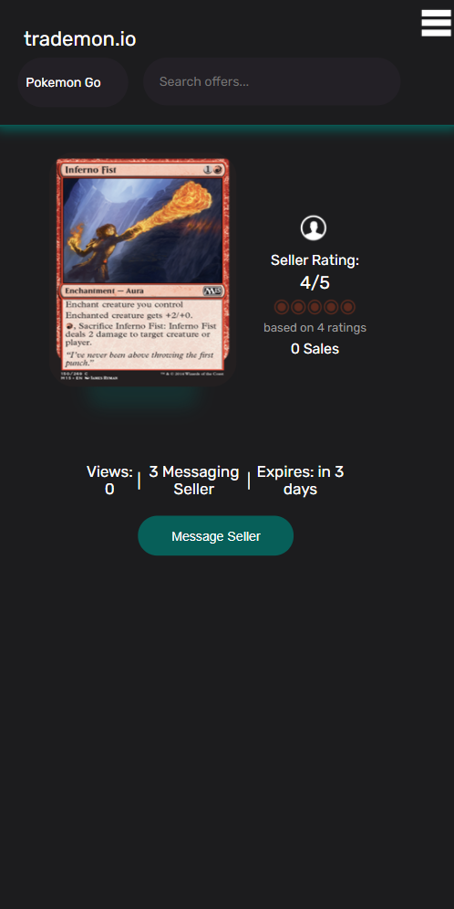
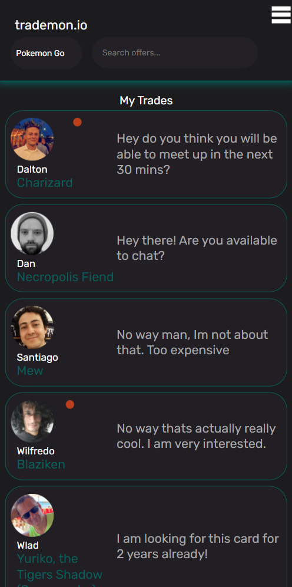

# Trademon
<!-- ALL-CONTRIBUTORS-BADGE:START - Do not remove or modify this section -->

<!-- ALL-CONTRIBUTORS-BADGE:END -->

trademon.io is a marketplace with social features for trading virtual goods acquired in online games (e.g. Pokemons from Pokemon Go, Magic The Gathering Online cards).

# How does it work?

In the dashboard you find the different supported games, each one with a preview of the highest ranked items.
After selecting a platform you get a list of all the available items for trade. You can browse or search by name for a particular item.
At any moment, you can select an item to see it in detail. The detail view has a **_Trade_** button that initializes the transaction.
The trading system has a video chat feature for arranging the details of the exchange p2p.

<h1 style="text-align: center">Dashboard</h1>

  

&nbsp;
&nbsp;

<h1 style="text-align: center">Item details and trade mesagges</h1>

  
  

&nbsp;
&nbsp;

<h1 style="text-align: center">Video Chat Beta</h1>

  

&nbsp;
&nbsp;

# Our collaborators:

- **[Dalton Klein](https://github.com/Dalton-Klein)**
- **[Wladimir Abdulayev](https://github.com/WladimirAbdulayev)**
- **[Adrian Di Felice](https://github.com/adriandifelice)**
- **[Wilfredo Campos](https://github.com/obi-wil)**
- **[Gabriel Jurado](https://github.com/gsjuradog)**

## Contributors ✨

Thanks goes to these wonderful people ([emoji key](https://allcontributors.org/docs/en/emoji-key)):

<!-- ALL-CONTRIBUTORS-LIST:START - Do not remove or modify this section -->
<!-- prettier-ignore-start -->
<!-- markdownlint-disable -->
<table>
  <tr>
    <td align="center"><a href="https://github.com/DanB-Web"> <b>DanB-Web</b></a> <a href="https://github.com/gsjuradog/trademon/commits?author=DanB-Web" title="Code">💻</a></td>
    <td align="center"><a href="https://github.com/Dalton-Klein"> <b>Dalton Klein</b></a> <a href="#content-Dalton-Klein" title="Content">🖋</a> <a href="https://github.com/gsjuradog/trademon/commits?author=Dalton-Klein" title="Code">💻</a></td>
    <td align="center"><a href="https://github.com/obi-wil"> <b>Wilfredo Campos</b></a> <a href="#content-obi-wil" title="Content">🖋</a> <a href="https://github.com/gsjuradog/trademon/commits?author=obi-wil" title="Code">💻</a></td>
    <td align="center"><a href="https://www.linkedin.com/in/adriandifelice/"> <b>Adrian Di Felice</b></a> <a href="#content-adriandifelice" title="Content">🖋</a> <a href="https://github.com/gsjuradog/trademon/commits?author=adriandifelice" title="Code">💻</a></td>
    <td align="center"><a href="https://github.com/WladimirAbdulayev"> <b>Wladimir Abdulayev</b></a> <a href="https://github.com/gsjuradog/trademon/commits?author=WladimirAbdulayev" title="Code">💻</a></td>
  </tr>
</table>

<!-- markdownlint-restore -->
<!-- prettier-ignore-end -->

<!-- ALL-CONTRIBUTORS-LIST:END -->

This project follows the [all-contributors](https://github.com/all-contributors/all-contributors) specification. Contributions of any kind welcome!